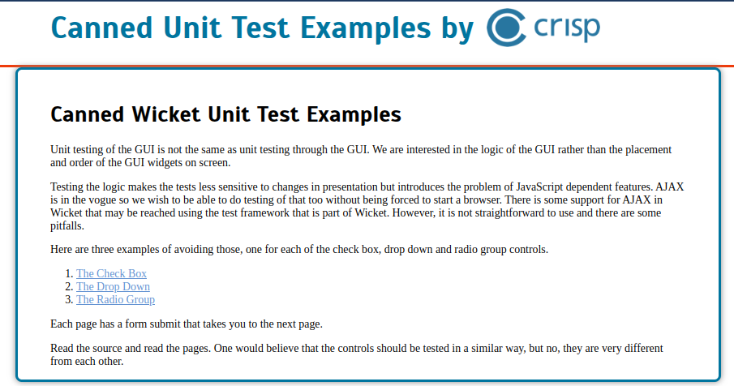
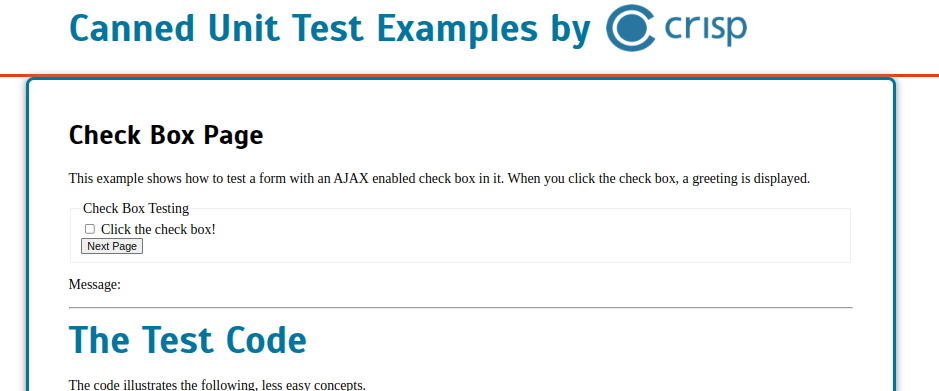
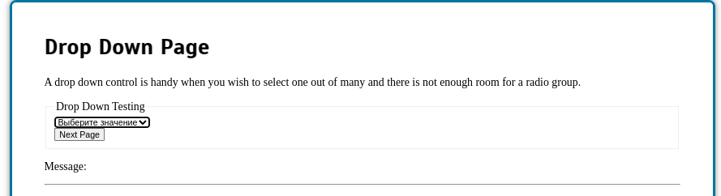
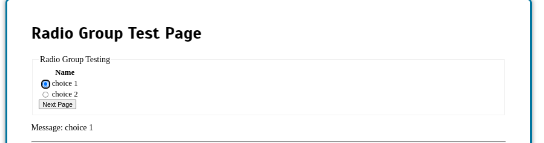
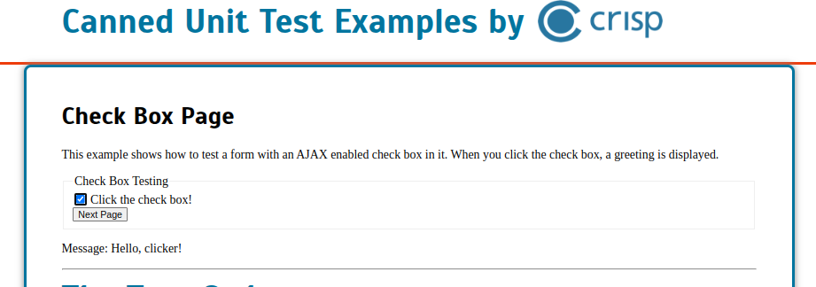

## Wicket test examples
=====

Self contained examples of testing Wicket Ajax web applications.

Build and deploy locally. Run with mvn jetty:run or run the Start class. Point browser to localhost:8080 and read.

Запуск

````shell
mvn jetty:run
````

или

````shell
./run.sh
````

Открыть

http://127.0.0.1:8080/wicket-test-examples

Картинки в doc:







Реакции логируются

Refcard в [doc/rc063-010d-apache_wicket.pdf](doc/rc063-010d-apache_wicket.pdf)

### Альтернативы Wicket:
- Spring MVC с JSP [Spring MVC — основные принципы (2017)](https://habr.com/ru/articles/336816/)
- Разные template frameworks (
    [Velocity templates](https://www.baeldung.com/apache-velocity), 
    [FreeMarker](https://freemarker.apache.org/) и т.п.
  )

Ссылки:
- [https://www.baeldung.com/intro-to-the-wicket-framework](https://www.baeldung.com/intro-to-the-wicket-framework)
- [Стили в Wicket](https://cwiki.apache.org/confluence/display/WICKET/Including+CSS+resources)